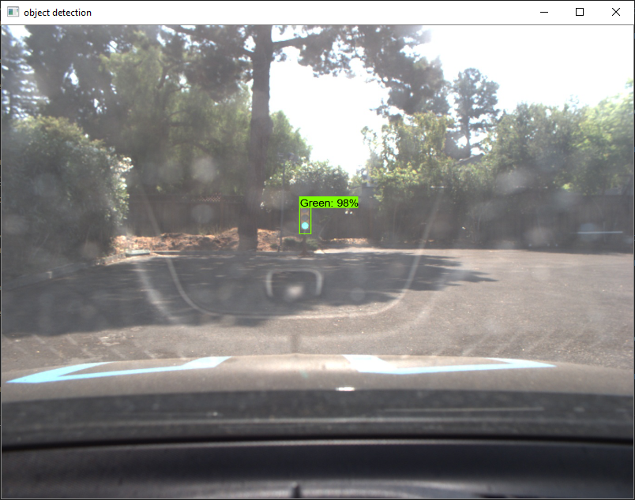

# **Traffic-Light-Detection**

#### Udacity Self Driving Car Engineer Nanodegree Program (Capstone Project)

## Project Introduction

The goal of this project is to train [Convolutional Neural Network (CNN)](https://de.wikipedia.org/wiki/Convolutional_Neural_Network) models for the Traffic Light Detection of the [Udacity Self-Driving Car Capstone Project](https://github.com/barrykidney/CarND-Capstone).
 
To detect traffic lights, [Carla](https://medium.com/udacity/how-the-udacity-self-driving-car-works-575365270a40) (Udacity’s actual Self-Driving Car) has a camera mounted behind the windshield, which periodically sends images to the Traffic Light Detector. The task of the Traffic Light Detector is to detect traffic lights and their respective color status in the pictures and to send the current color status to the planning module (Waypoint Updater), so that it stops the car at the stop line at 'red' or continues driving at 'green'.
The Traffic Light Detector uses a [Convolutional Neural Network (CNN)](https://de.wikipedia.org/wiki/Convolutional_Neural_Network) which has to be specially trained for the detection of traffic lights respectively their color states.

#### Scene from Simulator


#### System Architecture


For the Capstone project, it is necessary for the car to drive both a lap on the highway in the simulator and a lap on the course with Carla. While Carla provides 'real world' pictures of the environment, the simulator provides 'drawn' images, see example:

|Simulator (drawn image)         |Carla (real world image)   |
|--------------------------------|---------------------------|
|||


## Prerequisites
This project was created with the following programming environment:

* [CUDA 10.0](https://developer.nvidia.com/cuda-downloads)
* [cuDNN 7.5](https://developer.nvidia.com/cudnn)
* [TensorFlow 1.13.1](https://tensorflow.org)

Follow this [Tutorial](https://tensorflow-object-detection-api-tutorial.readthedocs.io/en/latest/install.html) to install the [Tensorflow Objecet-Detection API](https://github.com/tensorflow/models/tree/master/research/object_detection). 
But instead of using the original Tensorflow Object-Detection API, as described in the tutorial above, clone this [Traffic-Light-Detection](https://github.com/aboerzel/Traffic-Light-Detection) repository to a workspace directory `<project_dir>`.

## Traffic-Light-Detection
This project is based on the [Tensorflow Objecet-Detection API](https://github.com/tensorflow/models/tree/master/research/object_detection) and can be used to train models for the Traffic Light Detection and Classifier (Traffic Light Detection Node) of the [Self-Driving Car Capstone Project](https://github.com/barrykidney/CarND-Capstone).
The traffic light detection node takes a camera image as input, generates the bounding boxes around the detected traffic lights and supplies for each bounding box one score value for each of the 3 traffic light colors 'Red', 'Green' or 'Yellow'.

The Object-Detection API offers the possibility to use several [Pre-Trained Models](https://github.com/tensorflow/models/blob/master/research/object_detection/g3doc/detection_model_zoo.md) as the basis for a fine tuning.
This project also makes it possible to train traffic light detection models very flexibly with different pre-trained models.
After a few tests, we decided to use the `ssd_mobilenet_v2_coco_2018_03_29`, because it showed a good balance between performance and accuracy.

### Create Dataset:
The most important thing to train a practicable model is a data set corresponding to the respective problem!

This project uses the [mixed_train.record](https://drive.google.com/file/d/1S1KDLCS2ZVhJtb-cFUtpWTs5U2sR0oMT/view) and the [mixed_eval.record](https://drive.google.com/open?id=1pwOAFH0CUnXAykS91XsCBI846HJiauqw) data set from [Marco Marasca](https://github.com/marcomarasca/CarND-Traffic-Light-Detection) for training and evaluation, it includes a ready-labeled image collection for both the simulator and Carla.
But in the case that someone wants to use their own data set, the necessary steps are briefly described here.

##### 1. Collect Images
Collect images that correspond to the problem and store these in a sub-folder `<dataset dir>` of the `data` folder.
Keep in mind to collect enough pictures per class and about the same number of pictures per class.    

##### 2. Label Images
In the next step, the objects to be detected (traffic lights) must be marked in the images (bounding box) and each provided with a class label (red, green, yellow).
This can be done with the tool [LabelImg](https://github.com/tzutalin/labelImg).
 


LabelImg saves a annotation file in the [PASCAL VOC](http://host.robots.ox.ac.uk/pascal/VOC/) format for each labeled image in the `<annotations dir>`. 

##### 2. Create TFRecord Data Set

The [Tensorflow Objecet-Detection API](https://github.com/tensorflow/models/tree/master/research/object_detection) uses [TFRecord](https://medium.com/mostly-ai/tensorflow-records-what-they-are-and-how-to-use-them-c46bc4bbb564) data sets. The following command can be used to create a [TFRecord](https://medium.com/mostly-ai/tensorflow-records-what-they-are-and-how-to-use-them-c46bc4bbb564) data set from the images and generated annotation files:

```sh
(tf-gpu) <project_directory>\object_detection> python dataset_tools\create_pascal_tf_record.py 
    --label_map_path=config/labels_map.pbtxt
    --data_dir=data/<dataset dir> 
    --annotations_dir=data/<dataset dir>/<annotations dir>
    --output_dir=data/<dataset name>.record
```

The output is a single [TFRecord](https://medium.com/mostly-ai/tensorflow-records-what-they-are-and-how-to-use-them-c46bc4bbb564) data set file, that can be used by the Object-Detection API to train a model.
	
### Train Traffic-Light-Detection Model:
The following diagram shows the part of the project structure, which is important for the training of models.

The `data` subdirectory contains the train and evaluation data set. Before the training is started, the two data sets [mixed_train.record](https://drive.google.com/file/d/1S1KDLCS2ZVhJtb-cFUtpWTs5U2sR0oMT/view) and [mixed_eval.record](https://drive.google.com/open?id=1pwOAFH0CUnXAykS91XsCBI846HJiauqw) must be stored here.

The `config` directory contains the training pipeline configurations [ssd_inception_v2.config](object_detection/config/ssd_inception_v2.config) and [ssd_mobilenet_v2.config](object_detection/config/ssd_mobilenet_v2.config) for the models to be trained and the [labels_map.pbtxt](object_detection/config/labels_map.pbtxt) file which maps the class IDs to label texts.

The [Pre-Trained Models](https://github.com/tensorflow/models/blob/master/research/object_detection/g3doc/detection_model_zoo.md), which are used as a basis for fine tuning, will be stored in the directory `models`. Here, a corresponding subdirectory is created for each model type. Before starting the training the models [ssd_mobilenet_v2_coco_2018_03_29](http://download.tensorflow.org/models/object_detection/ssd_mobilenet_v2_coco_2018_03_29.tar.gz) and [ssd_inception_v2_coco_2018_01_28](http://download.tensorflow.org/models/object_detection/mask_rcnn_inception_v2_coco_2018_01_28.tar.gz) have to be downloaded and unpacked here.

The checkpoints which are created during the training run will be stored in the `checkpoints` directory. These are stored in subdirectories named according to the model type.

The `fine_tuned_models` directory contains the exported models, which are ultimately used by the Traffic-Light-Detector. These are also stored in subdirectories named according to the model type.

All other directories belong to the Object-Detection API and are not relevant for the training.

```
.<project_dir>\object_detection
├── data
│   ├── mixed_train.record
│   ├── mixed_eval.record
│   :
│
├── config
│  ├── labels_map.pbtxt
│  ├── ssd_inception_v2.config
│  ├── ssd_mobilenet_v2.config
│  ├── ...
│  :
│       
├── models
│   └── ssd_inception_v2_coco_2018_01_28
│   │   ├── checkpoint
│   │   ├── frozen_inference_graph.pb
│   │   ├── model.ckpt.data-00000-of-00001
│   │   ├── model.ckpt.index
│   │   ├── model.ckpt.meta
│   │   └── saved_model
│   │       ├── saved_model.pb
│   │       └── variables
│   │
│   ├── ssd_mobilenet_v2_coco_2018_03_29
│   │   ├── ...
│   :   :
│
├── checkpoints
│   ├── ssd_inception_v2_coco_2018_01_28
│   │   ├── checkpoint
│   │   ├── model.ckpt-12345.*
│   │   :
│   │
│   ├── ssd_mobilenet_v2_coco_2018_03_29
│   │   ├── checkpoint
│   │   ├── model.ckpt-12345.*
│   │   :
│   :
│
├── fine_tuned_models
│   ├── ssd_inception_v2_coco_2018_01_28
│   │   ├── saved_model
│   │   ├── frozen_inference_graph.pb
│   │   :
│   │
│   ├── ssd_mobilenet_v2_coco_2018_03_29
│   │   ├── saved_model
│   │   ├── frozen_inference_graph.pb
│   │   :
│   :
│
```

The following steps describes how to train a model for the [Udacity Self-Driving Car Capstone Project](https://github.com/barrykidney/CarND-Capstone) under Windows 10:

1. Open a Anaconda Prompt
```sh
(base) ..>
```

2. Activate your virtual environment, which you have set up for the Tensorflow Object-Detection API.
```sh
(base) ..> activate tf-gpu
```

3. Set the environment variable `PROJECT_DIR` to the `<project_dir>` directory to which you have cloned this project:
```sh
(tf-gpu) ..> set PROJECT_DIR=<project_directory>
```

4. Set the environment variable `PYTHONPATH` as follows:
```sh
(tf-gpu) ..> set PYTHONPATH=%PROJECT_DIR%;%PROJECT_DIR%\slim;%PROJECT_DIR%\object_detection
```

5. Change to the object-detection directory
```sh
(tf-gpu) ..> cd %PROJECT_DIR%\object_detection
```

6. Train Traffic-Light-Detection Model (for example using ssd_mobilenet_v2_coco_2018_03_29):
```sh
(tf-gpu) <project_directory>\object_detection> python model_main.py --pipeline_config_path=config/ssd_mobilenet_v2.config --model_dir=checkpoints/ssd_mobilenet_v2_coco_2018_03_29
```

After the training has been completed, the trained model is located at:
```sh
<project_directory>\object_detection\checkpoints\ssd_mobilenet_v2_coco_2018_03_29\model.ckpt-20000*
```

7. Training Monitoring

To monitor the training, you can start [Tensorboard](https://www.tensorflow.org/guide/summaries_and_tensorboard) from a second console. Here you can see if and how well the model has already learned.
```sh
(tf-gpu) <project_directory>\object_detection> tensorboard --logdir=checkpoints/ssd_mobilenet_v2_coco_2018_03_29
```
 
Tensorboard:


8. Export Model

In order to use the model in production the graph must be frozen, this can be done with the following command:

```sh
(tf-gpu) <project_directory>\object_detection> python export_inference_graph.py --input_type image_tensor --pipeline_config_path training/ssd_mobilenet_v2.config --trained_checkpoint_prefix checkpoints/model.ckpt-20000 --output_directory fine_tuned_models/ssd_mobilenet_v2_coco_2018_03_29/
```

After exporting, the frozen model is located at:
```sh
<project_directory>\object_detection\fine_tuned_models\ssd_mobilenet_v2_coco_2018_03_29\frozen_inference_graph.pb
```

To use this frozen model with the [Udacity Self-Driving Car Capstone Project](https://github.com/barrykidney/CarND-Capstone) the file `frozen_inference_graph.pb` must be copied and renamed to the ROS environment `/ros/src/tl_detector/light_classification/tl-detection-model.pb` of the Capstone Project. 
		    	
### Test the Model
You can test the fine tuned model using the [Traffic Light Detection Tutorial](object_detection/traffic_light_detection_tutorial.ipynb): 

```sh
(tf-gpu) <project_directory>\object_detection> jupyter notebook traffic_light_detection_tutorial.ipynb
```

 The results looks like this:

|Carla (real world image)     |Simulator (drawn image)     |
|-----------------------------|----------------------------|
|||
|||
|||
|||
|||


Alternatively, the model can be tested with the TrafficLightClassifier.py, which is an equivalent implementation to the Traffic Light Detection Node implementation of the [Udacity Self-Driving Car Capstone Project](https://github.com/barrykidney/CarND-Capstone).
```sh
(tf-gpu) <project_directory> python TrafficLightClassifier.py --frozen-model-path=./object_detection/fine_tuned_models/ssd_mobilenet_v2_coco_2018_03_29/frozen_inference_graph.pb --image=./object_detection/test_images/real/left001.jpg
```

The result looks like this:


